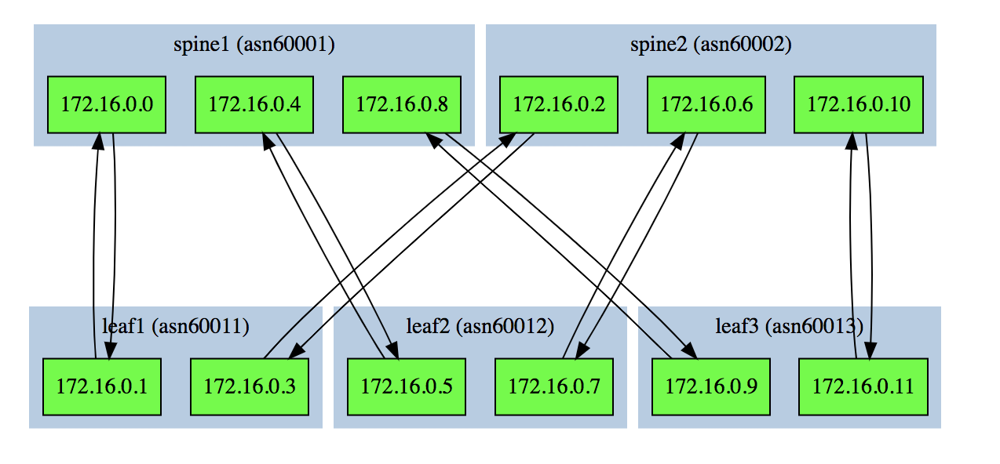
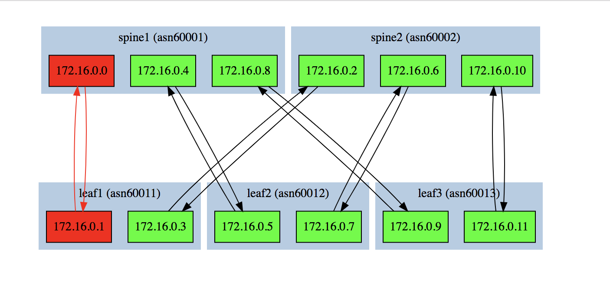

# Junos BGP Topology Discovery & Visualization Lab

## Summary

My goal in this exercise was to use `NAPALM` and `Nornir` to extract BGP state from the devices and use that BGP state to generate a web based visualization showing BGP neighbor connections and state (up/down).  The lab is a simple 2 spine 3 leaf physical topology running on Juniper vQFX.

Technologies used to accomplish stated goal:

- `Python3`
- `NAPALM` - Handles device connections and BGP state extraction.
- `Nornir` - Handles multi-threaded automation orchastration.
- `Jinja2` - Renders the DOT node/edge output.
- [`d3-graphviz`](https://github.com/magjac/d3-graphviz) - used to render DOT format in web browser.

>NOTE: This is just a toy example meant as a PoC.  I took lots of shortcuts to get to a working solution.  If anyone plans to use any of the code and/or templates keep in mind that adjustments will likely need to be made to work in your environment.

# Running the BGP state visualization tool

#### Bringing up lab topology
 For starters, you need to get the Junos lab running.  See [the Juniper Lab README.md](lab-provision/README.md).

 I can't say I documented the process to get the lab working perfectly, and it's only been tested on MacOS.  Good luck...


#### Generating and viewing BGP state 
 Once you have the Juniper lab running, run:
 ```
 python render_bgp_topology.py
 ```

This will generate a `bgp_topology.html` file, which contains some javascript libraries that can generate a simple web page from DOT input string.

>NOTE: I did not write the JS code myself.  It was lifted from [this great example](https://bl.ocks.org/magjac/a23d1f1405c2334f288a9cca4c0ef05b).  Other helpful examples by the same auther can be [found here](https://bl.ocks.org/magjac).

#### Viewing BGP State

Point your browswer to the local html file that was just rendered by finding the full filepath and putting it into your browsers search bar:
Example:
```
file:///Users/some-user/git-repos/network-automation-course/Homework2/bgp_topology.html
```

If all BGP neighbor are up, all nodes will be green.  If a neighbor is in the down state, the node will turn red and the edge will turn red.

Example with all BGP sessions up:



Now, if an interface is disabled, the rendered output will reflect a down BGP neighbor:



