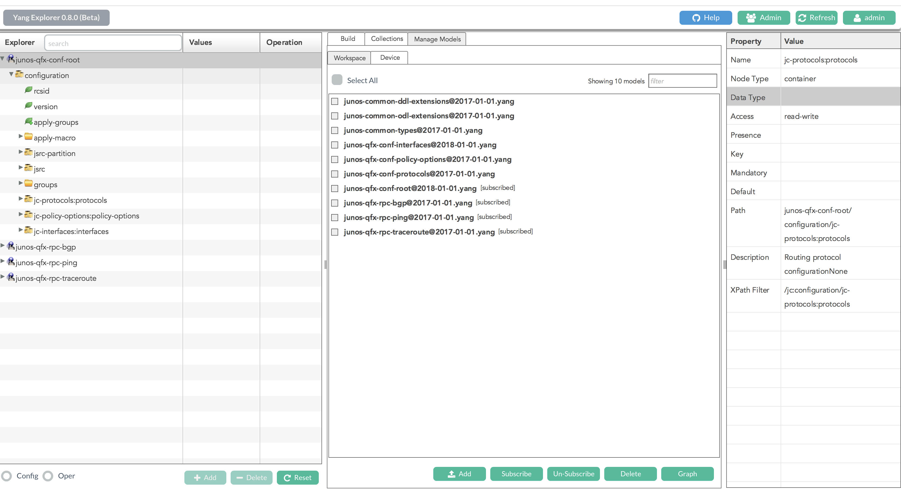

# The End (Of Templates) Is Near!
What would network automation that didn't depend on templates look like?  I've been interested in this topic for a long time, but didn't have the time to follow up on that interest.  So, my goal for this assignment was to dive into some of the technologies that have been developed to make model driven network configuration and operations possible.

Once again, I'm using the Junos vQFX devices for this lab.  This led to an interesting challenge that I'll go into more below.


# Discoveries

I began my adventures by experimenting with [NAPALM-YANG](https://github.com/napalm-automation/napalm-yang) and [pyang](https://github.com/mbj4668/pyang)/[pyangbind](https://github.com/robshakir/pyangbind).  NAPALM-YANG had a couple of interesting features, but I couldn't really wrap my head around any practical use-cases.  It also didn't look like it was under very active development.  Pyang & pyangbind are under more active development, but it looked like it was going to be a lot of work to utilize them; however, playing with them helped me gain a better understanding of what YANG actually was (as was not), but after going through a few tutorial I found my self thinking "ok, now what?".

After toiling about for a few days I ran across a NANOG 68 video titled [Ok, We Got YANG Data Models.  Now What](https://www.youtube.com/watch?v=2oqkiZ83vAA).  The first thing I noticed was that it was a Cisco presentation - and my initial feeling was, "Uhg, this is just going to be a ridiculous over-hyped sales pitch..."  However, I was very surprised to learn that Cisco had open sourced a real solidly designed YANG code generation library named [YDK-GEN](https://github.com/CiscoDevNet/ydk-gen).  The beauty of this library was that it could creating bindings in multiple languages, including Go, Python and C++.  Each language binding comes with a huge set of pre-build bindings (for all the languages they currently support mentioned above) for Cisco OS's and some of the OpenConfig & IETF models as well.

I was highly impressed with the NANOG presentation and the YDK-Gen and YDK-Py libraries.  Since I was using a Junos lab, I needed to create my own Junos YANG model Python bindings.  I first tracked down and copied the Junos YANG models I was interested in implementing [from here](https://github.com/Juniper/yang/tree/master/17.4/17.4R1).  Then I followed the directions [from here](https://github.com/CiscoDevNet/ydk-gen#generate-ydk-components) to create my Python bindings.  **NOTE**: If you want to generate your own YDK bindings, using the provided [docker image](https://github.com/CiscoDevNet/ydk-gen#docker) will save you some time and trouble.  Here is [the model bundle profile](Homework3/profiles/junos-qfx-17_4R1.json) I wrote to generate Junos Python bindings.  The generated bindings are [here](Homework3/projects).  Once I had the `tar.gz`, I just needed to `pip install` (which happens in the vagrant file) and off I went!

## Yang Explorer
Cisco has also released a web-based [YANG explorer](https://developer.cisco.com/codeexchange/github/repo/CiscoDevNet/yang-explorer/), which greatly helps with navigating and making sense of a particular yang model.

The easiest way to get yang-explorer running is to use the [dockerfile here](https://hub.docker.com/r/robertcsapo/yang-explorer/).



# Edge Builder Lab

The lab is pretty simple.  I wanted to create a simple data-model that modeled edges between two nodes.  Then, I'd use `ydk-py` to configure the edges, which consists of configuring the interfaces and BGP adjacencies.  My goal, as mentioned above, was to leverage NETCONF and YANG Model bindings to configure a device.  

Topology ([find this setup here](https://github.com/Juniper/vqfx10k-vagrant/tree/master/light-2qfx))
```
                ==========
                | server |
                ==========
        _____________|_____________
       |                           |
    em3|                        em3|
=============               =============
|           |  em5 - em7    |           |
|   vqfx1   | ------------- |   vqfx2   |
|           | ------------- |           |
=============               =============
```

Before running the script, only `em3` is configured for management traffic.  After running the script the inter-chassis links (em5 - em7) will be configured.


## Steps to reproduce lab
**NOTE:** This YDK tooling is ran from a vagrant box, not your local machine; however, the initial provisioning of the lab linux server and vqfx devices requires `ansible` and `junos-eznc` be installed locally -- which is installed into a virtualenv during the `pipenv install` portion below.

```
git checkout https://github.com/ctopher78/network-automation-course.git

cd network-automation-course/Homework3

pipenv install

pipenv shell

vagrant up

vagrant ssh ydk-py-ubuntu

cd samples/

python crud_provider.py
```

## Example
```
vagrant@server:samples$ python crud_provider.py
Configuring edges for:  vqfx2
setting up netconf provider for: '10.10.2.1'
adding neighbor '10.10.5.1', peer asn '60001'
adding neighbor '10.10.6.1', peer asn '60001'
adding neighbor '10.10.7.1', peer asn '60001'
Configuring edges for:  vqfx1
setting up netconf provider for: '10.10.1.1'
adding neighbor '10.10.5.2', peer asn '60002'
adding neighbor '10.10.6.2', peer asn '60002'
adding neighbor '10.10.7.2', peer asn '60002'
```

## Before

### Interfaces
```
vagrant@vqfx1> show interfaces terse em[5-7]*    
Interface               Admin Link Proto    Local                 Remote
em5                     up    up
em6                     up    up
em7                     up    up
```

### BGP Adjacencies
```
vagrant@vqfx1> show bgp summary | match "10\.10\.[5-7]\.2"    
 
```

## After

### Interfaces
```
vagrant@vqfx1> show interfaces terse em[5-7]* 
Interface               Admin Link Proto    Local                 Remote
em5                     up    up
em5.0                   up    up   inet     10.10.5.1/30    
em6                     up    up
em6.0                   up    up   inet     10.10.6.1/30    
em7                     up    up
em7.0                   up    up   inet     10.10.7.1/30  
```

### BGP Adjacencies
```
vagrant@vqfx1> show bgp summary | match "10\.10\.[5-7]\.2" 
10.10.5.2             60002         25         23       0       0        9:39 1/5/5/0              0/0/0/0
10.10.6.2             60002         25         23       0       0        9:35 1/5/5/0              0/0/0/0
10.10.7.2             60002         24         22       0       0        9:31 1/5/5/0              0/0/0/0
```

## Data Model
The (very) simple data model for this [is here](samples/node_edges.yaml).


